# 10CT2 Task 2 Web Apps - Project Documentation
The website is hosted by Github Pages using Jekyll https://identity-fraud.github.io/10CT2-Task-2-Webapps

run ``bundle exec jekyll serve`` with jekyll installed to run locally

note that website name is in fact the website name and is not a placeholder (neither is the favicon)

hidden things: 
* the blog post search actually in fact does work and uses some complex javascript
* tags that appear at the top of posts are intended to immediately search the tag when clicked on (doesn't work)
* 404 page used when in a nonexistant page
* you may not have noticed but the highlight colour is set inversed (but manually) meaning changing themes also switches highlight theme
* colour scheme is saved in localStorage meaning exiting the website and going back in has the saved colour scheme (might flicker)
## Identifying and Defining
Divergent Mindmaps on Excalidraw

Brainstorming

| Idea name                          | What it does                                                               | Influence it explores | Who it helps                                   |
| ---------------------------------- | -------------------------------------------------------------------------- | --------------------- | ---------------------------------------------- |
| Screen time app                    | Limits your screentime by locking down your device after a set time period | Social Media          | Someone who has social media addiction         |
| Motivational quotes site           | Displays a different motivational quote everyday                           | Society               | Unmotivated people                             |
| Blog                               | Website that has blogs or posts uploaded                                   | Information           | People seeking information or opinion          |
| Multi-perspective news aggregators | Collects news and articles and sorts them by different "perspectives"      | Information           | Anyone looking for an unbiased source          |
| Anonymous social media             | Social media without the ability to have profiles or accounts              | Social Media          | People who dislike conformity and want privacy |
| Search Engine                      | A site to search up other sites                                            | Information           | People seeking information or opinion          |

Impact Effort Matrix

SWOT Analysis

### Reflection
In my web ideas I visualised in the impact/effort matrix, the blog, screen time app, and multi-perspective news aggregator were the three most efficient ideas that had similar impact and effort. The news aggregators would be the most difficult/high effort out of three and I believe that it would be out of scope to create a web app for this due to how specific it is, especially when other people have already done this (e.g GROUND news). The screen time app would be promising and easy to build but has the least impact out of three, and there would be little to make it different compared to other similar screen time apps. This leaves the blog, as it can have any information that I would want on it to make it unique, making it informational and thus influential and has a balanced impact to effort making it the one web app idea I will make.

## Functional and Non-functional Requirements
### Purpose

The website will be a blog designed in showing various posts from it, which can be informational or helpful. It is intended to engage with similar thinking computing technology students. 

### Functional Requirements
* The user should be able to view different posts in the blog
* Ability to search/filter for other posts
* Navigation pages for the primary github repository and copyright notice are necessary
* Support RSS live feed
* Main landing page for general information of the website
* Trustworthy information with cited sources

### Non-functional requirements
* Should load quickly (<2s)
* Page layout should be generic or atleast easy to navigate

## Researching and Planning
### PMI Table

| Webapps            | Plus                                                                                                                                                                           | Minus                                                                                                                                | Implication                                                                                                                                                                                                                                                     |
|--------------------|--------------------------------------------------------------------------------------------------------------------------------------------------------------------------------|--------------------------------------------------------------------------------------------------------------------------------------|-----------------------------------------------------------------------------------------------------------------------------------------------------------------------------------------------------------------------------------------------------------------|
| Wikipedia          | Free information about almost every public event and notable person. Anyone can contribute. No ads or tracking. Large variety of supported languages. Designed to be unbiased. | Anyone can contribute meaning people can grief pages. They cannot make money without donations                                       | Wikipedia is able to be the largest source of information on the internet through its community volunteers/contributors. Because they do not show ads or sell user data, or have any subscription model or pricing, Wikipedia is forced to be run by donations. |
| MiguelGrinberg.com | Tutorials on many subjects in computing. Posts explaining the internet and other webapps. Free consultation of your websites from Miguel.                                      | The influence is limited as the information is provided is solely based on what Miguel understands (focused on sqlalchemy and flask) | Miguel has many posts about technology but outside it the blog is very limited.                                                                                                                                                                                 |
| Our World In Data  | Large collection of data about any ongoing events. Easy to understand visualisations of the data through charts and graphs, along with added context or information in posts.  | The data could be skewed or indirectly biased.                                                                                       | Our World In Data gathers data from multiple sources, which could lead to duplicate or incorrect data shown in visualisations, the data itself could be biased in many ways as they were from a third party.                                                    |

### Secondary Research
I am trying to influence people to use a more trustworthy source for their information, rather than using AI or social media. 

Sources:  
Emily Denniss, Rebecca Lindberg, Social media and the spread of misinformation: infectious and a threat to public health, Health Promotion International, Volume 40, Issue 2, April 2025, daaf023, https://doi.org/10.1093/heapro/daaf023 (Oxford Academics Journal)

Germani F, Spitale G, Biller-Andorno N. The Dual Nature of AI in Information Dissemination: Ethical Considerations. JMIR AI. 2024 Oct 15;3:e53505. doi: 10.2196/53505. PMID: 39405099; PMCID: PMC11522648. https://pmc.ncbi.nlm.nih.gov/articles/PMC11522648 (PubMed Central NIH)

Social media contributes significantly to the spread of misinformation globally. This is due the speed social platforms allow users to publish about anything, regardless of their qualifications or knowledge. Misinformation is also favoured by algorithms as they garner higher engagement. This can result in public health issues as people are misinformed into taking or not taking health products and a loss of trust with experts as people grow dependant on social media

The use of artificial intelligence has also contributed to the rise of misinformation. AI systems are designed to appease the user, meaning it may choose to knowingly give misinformation (or "disinformation" for intentional misinformation) to please the user in the short term. Due to the fact that these systems will always generate seemingly correct and confident responses, there are many potential risks in using AI for information. Influencer and politicians may be misinformed by the AI and continues a cycle of misinformation.

This is why creating a blog containing truthful information is extremely influential in this time as it will provide more human and reliable information than AI (this depends on the person making the blogs though). 

### Primary Research
Form link: https://forms.gle/GK2mPFjgMkK4WZsE9
6 responses for 8 questions (short form responses were optional) and anonymised 

Question 1
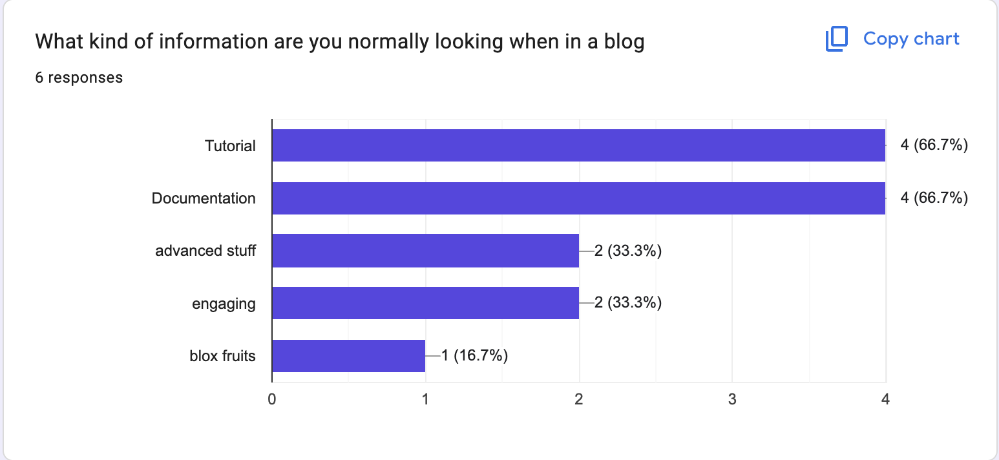

Question 2
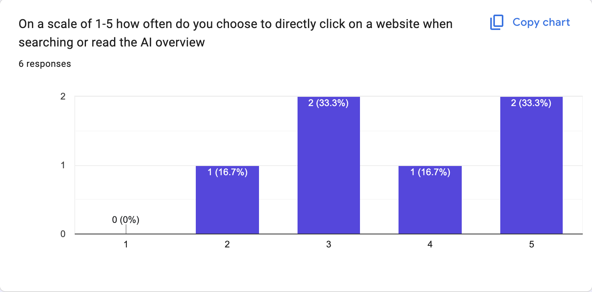

Question 3
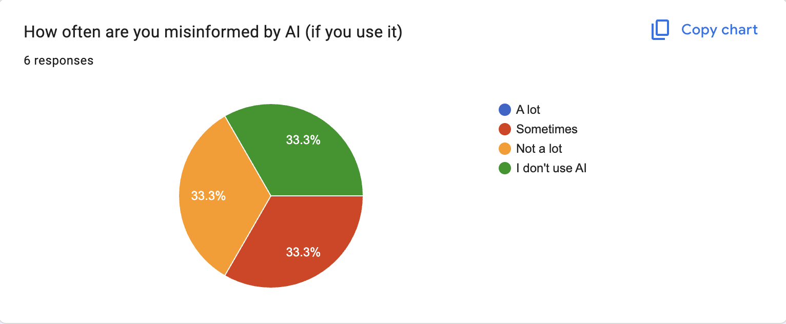

Question 4
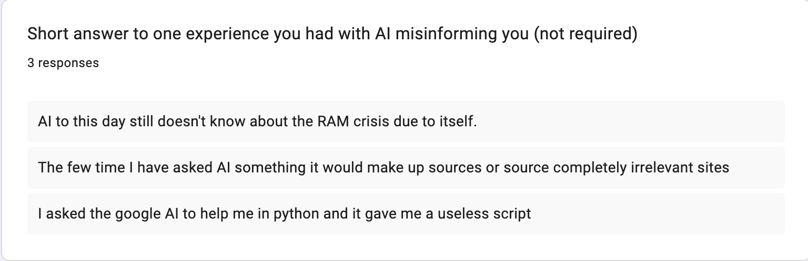

Question 5
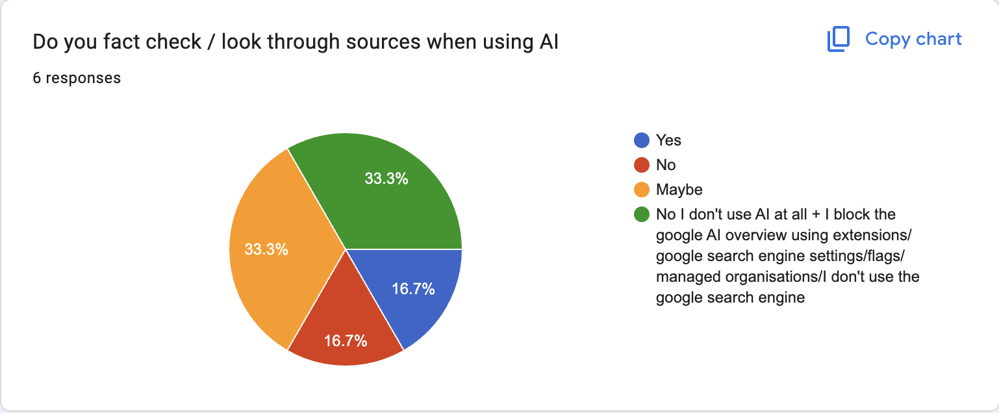

Question 6
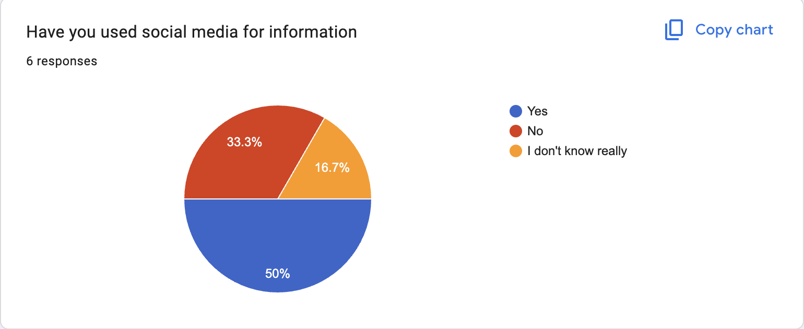

Question 7
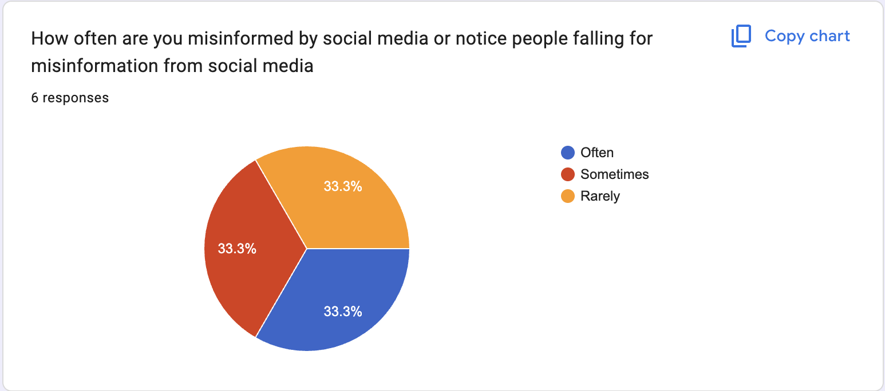

Question 8
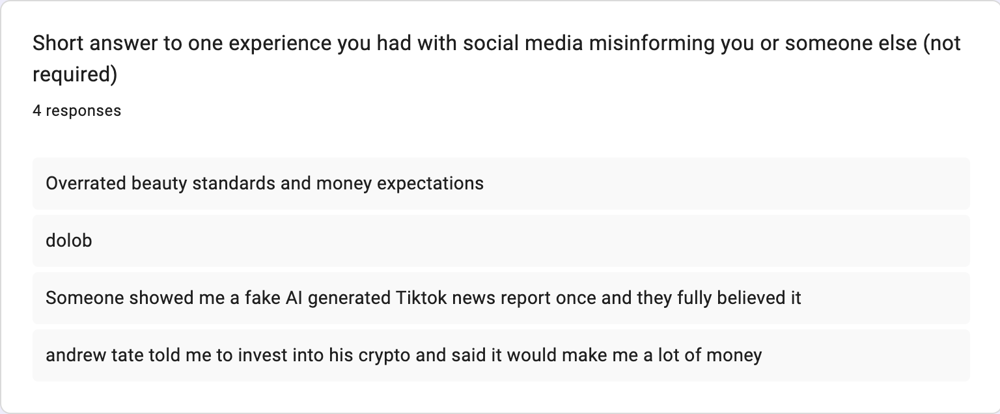

These responses show that AI and social media misinformation is a major issue in society and many people still choose to trust AI and such. This does slightly impact my project as I did not realise that this much people use AI this much without checking its sources or if its information is correct. This means I will probably try to push for sources to be more clear in my blog posts as to prove its accuracy compared to the AI and change people into confirming if the information they see online is correct.

### UI/UX Design
Homepage wireframe
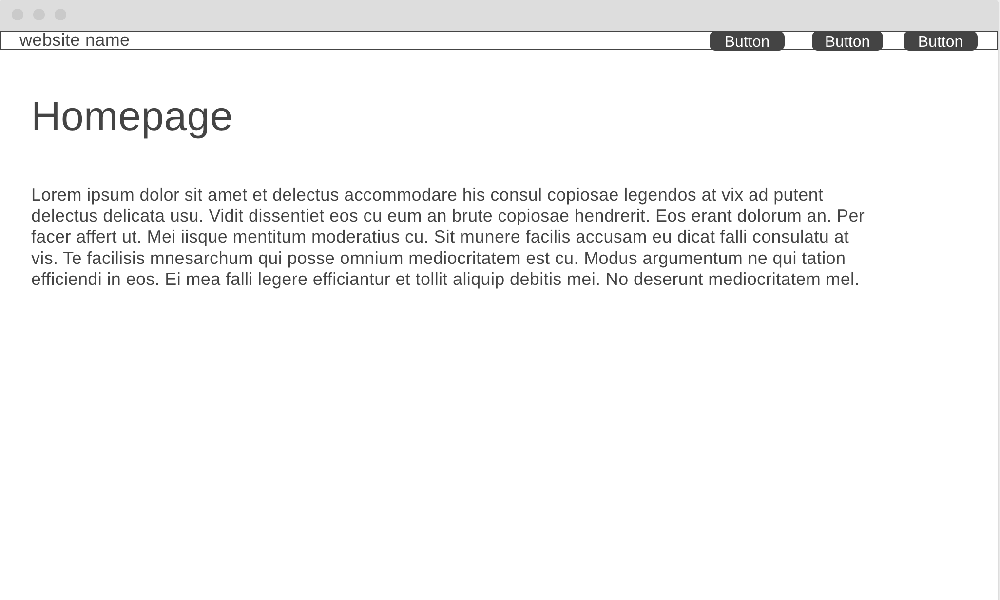

Blog page wireframe
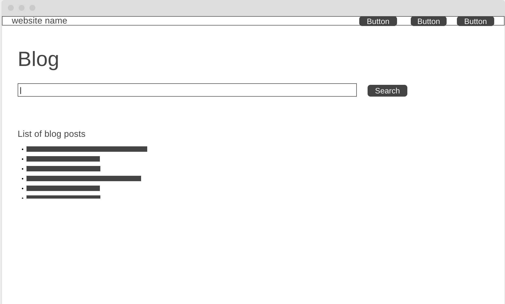

Blog post page wireframe
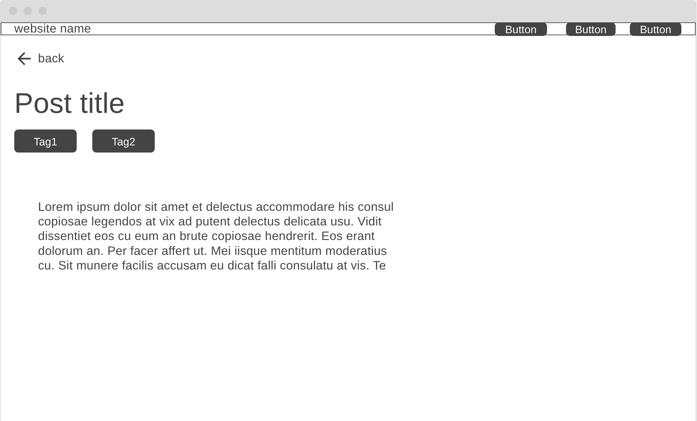

These are the finalised wireframes (though do not represent the actual final website) that I made after going through a few redesigns

### Prototype
I have a prototype at https://identity-fraud.github.io/10CT2-webapps/ which was from a previous repository I abandoned due to Jekyll breaking when I attempted to manually install it into the project. 

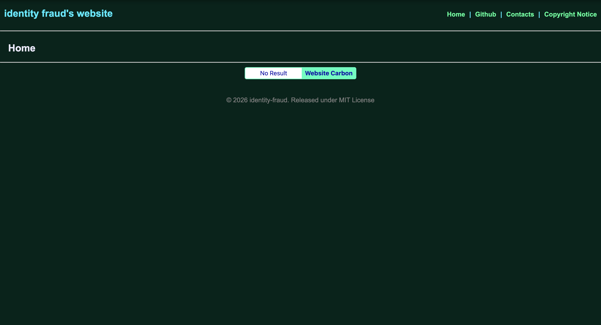

## Producing and Implementing
The documenting part starts now (20/09 12:42 AM). When I decided on making a blog for my influential webapp, I was largely inspired by Miguel's website (miguelgrinberg.com) and the colour scheme is very similar. In the beginning, I already decided I will not be using Flask as Github Pages does not support it due to being a static server provider. I was considering between using Astro or Jekyll as the site generator and decided on Jekyll due to it being built into Github Pages as a Github action and it being much more simpler. This means I will be using Javascript for "backend" which will not be easy as I have not learnt it yet. I took many ideas from my earlier websites such as the typical navigation header and footer. My first roadblock was when I attempted installing and running Jekyll through Github Pages after I already created my website and with a nested folder (/site), this subsequently broke the runner and I chose to restart on a completely new repository even though this issue could've been solved by editing the .github/workflows/jekyll-gh-pages.yml Github Pages config. At this stage I had a simple header, footer, website icon and a few pages but there was yet to be any posts yet or a search function. I then did a redesign on the project structure to make it cleaner I guess and modulised every major file (e.g main style.css split into style.css and post.css in the styles/ folder) and then I started learning Javascript to create a theme toggle button. In the beginning I chose to use data-theme to store and switch colours from light to dark mode with very simple Javascript but the issue arose where my input box for searching did not switch colours, and originally I chose to avoid Javascript as much as possible which caused an issue with my dark icons being unable to be swapped. I solved this by using color-scheme: light dark which is not the best practice but allowed me setting paths to different svgs meaning icons were swapped with the corresponding themed icon to match the theme. I stored the colour scheme into Javascript in LocalStorage which allows saving the colour scheme even when I went to other pages or closed and reopened the website. I then went into another issue where my site refused working due to having nested folders everywhere, I solved this by using relative paths forcing Jekyll to look 1 folder up to find any referencing files. The most difficult part was making the search function using Javascript, I decided against using a third party extension like jekyll-search to do this for me and chose to do it purely in Javascript to fulfill the project. Using a combination of Liquid tags and Javascript I was able to make a method where I can pull the data generated from a liquid tag for loop listing the metadata/front matter of every post (in _posts) and then used Javascript to handle it and display the corresponding data like date and summary, and grabbed the input text search button for queries and used it to match with other posts and displays any that do match.

## Testing and Evaluating
### Peer Evaluation

Critieria: UX, Aesthetics, Accuracy, Influence. Out of 10 each

UX: 9/10
Very user-friendly and easy to navigate. Layout is not confusing at all and anyone could understand it. The functionality of searching posts will be very useful once the quantity of posts becomes unwieldy. The blog posts are clearly dated and even have a description for more information. Only thing I don't understand is how the tags work/what they even do.

Aesthetics: 8/10
Incredibly sleek and modern design, which is simple without being basic. The transition between light and dark mode is nice. The search bar on the blog looks out of place and could be stylised. The grey background and magenta accent in light mode is quite ugly compared the dark mode colour scheme, but who uses light mode anyway.

Accuracy: 6/10
Being a personal blog, there is potential for biased or inaccurate information. On the one (real) blog post, the information seems to be accurate but lacks any credits or sources for the information. Is the user supposed to blindly trust everything you post?

Influence: 6/10
AI misinformation can be a problem, so a trustworthy source of information free of AI is valuable. However, as previously stated, the blog is not entirely trustworthy, and only contains topics which you decide to post about. If a user wants to find trustworthy information on a topic which you haven't posted about, they are better off just searchng google and ignoring/removing the AI overview.
-by F.M

Their website is very well made and I can see that a lot of time has been put into it. The website is very aesthetically pleasing, containing a very relaxed programmy feel to it and all the buttons are nice and feel smooth to click. The blog as a whole is very functional and informative and teaches me a lot about Jekyll and the navigation points are also very obvious, highlighted with a fitting green. The entire website is easy to navigate and has multiple accessibility options such as changing from dark to light mode. The base blog has correct and logical information and can be an effective way to learn but it is held back by its minimal procedures and single created strand from the blog. But overall the website scores well within all of its criteria of aesthetics UX and functionality.
-by A.R

### Project Evaluation
I have realised now that a blog has no influence if there is nothing influential within it. Even though this project proves my programming capabilities knowledge I learnt, this does not exactly align with the purpose of this project, which is to make an influential web app. Obviously if I had more than 1 useful blog post it would be far more influence but even then it is strictly limited to what I already understand making its influence narrow. It did though meet most of my functional and non-functional requirements except for a standalone copyright disclosure page and RSS feed, reasons where that I decided to use ARR (all rights reserved) to prevent using both a software license and Creative Commons license, as they each serve different purposes (software licenses only cover software aspects and CC licenses only cover media/texts) which a dual license method would be required for the blog which would be complicated. The RSS feed would also have required using an external Jekyll plugin which seems kind of cheating. I think my project management has been very good excluding the part where I restarted on a new Github repository as the old one broke when I attempted to install Jekyll ontop. Its impact on the target market would not be very large as there are thousands of other blogs out there which many probably having more influential information and better websites than mine, but it still has an impact after all and I may in fact expand this after this assessment. The website itself excelled in its UX and aesthetics (from my peer evaluation) and I think I am happy with that regardless of its influence.
