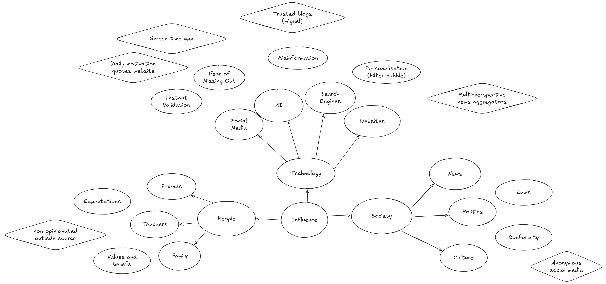
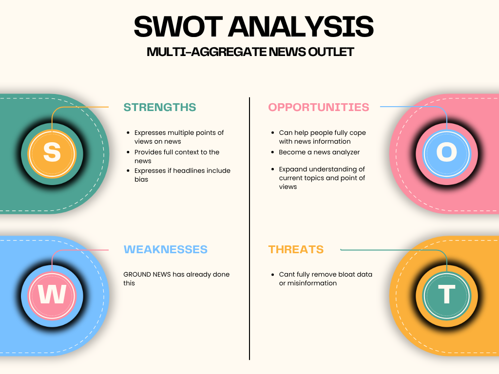
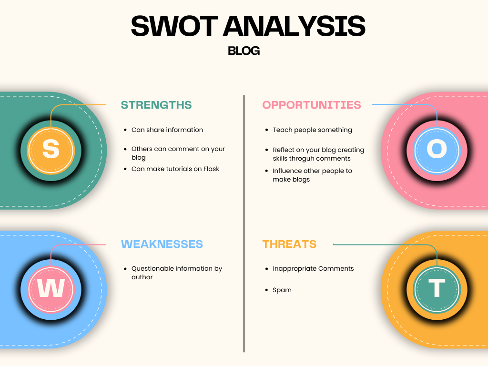

# 10CT2 Task 2 Web Apps - Project Documentation
The website is hosted by Github Pages using Jekyll https://identity-fraud.github.io/10CT2-Task-2-Webapps
## Identifying and Defining
Divergent Mindmaps on Excalidraw

Brainstorming

| Idea name                          | What it does                                                               | Influence it explores | Who it helps                                   |
| ---------------------------------- | -------------------------------------------------------------------------- | --------------------- | ---------------------------------------------- |
| Screen time app                    | Limits your screentime by locking down your device after a set time period | Social Media          | Someone who has social media addiction         |
| Motivational quotes site           | Displays a different motivational quote everyday                           | Society               | Unmotivated people                             |
| Blog                               | Website that has blogs or posts uploaded                                   | Information           | People seeking information or opinion          |
| Multi-perspective news aggregators | Collects news and articles and sorts them by different "perspectives"      | Information           | Anyone looking for an unbiased source          |
| Anonymous social media             | Social media without the ability to have profiles or accounts              | Social Media          | People who dislike conformity and want privacy |
| Search Engine                      | A site to search up other sites                                            | Information           | People seeking information or opinion          |

Impact Effort Matrix

SWOT Analysis

### Reflection
In my web ideas I visualised in the impact/effort matrix, the blog, screen time app, and multi-perspective news aggregator were the three most efficient ideas that had similar impact and effort. The news aggregators would be the most difficult/high effort out of three and I believe that it would be out of scope to create a web app for this due to how specific it is, especially when other people have already done this (e.g GROUND news). The screen time app would be promising and easy to build but has the least impact out of three, and there would be little to make it different compared to other similar screen time apps. This leaves the blog, as it can have any information that I would want on it to make it unique, making it informational and thus influential and has a balanced impact to effort making it the one web app idea I will make.

## Functional and Non-functional Requirements
### Purpose

The website will be a blog designed in showing various posts from it, which can be informational or helpful. It is intended to engage with similar thinking computing technology students. 

### Functional Requirements
* The user should be able to view different posts in the blog
* Ability to search/filter for other posts
* Navigation pages for the primary github repository and copyright notice are necessary
* Support RSS live feed
* Main landing page for general information of the website
* Trustworthy information with cited sources

### Non-functional requirements
* Should load quickly (<2s)
* Page layout should be generic or atleast easy to navigate

## Researching and Planning
### PMI Table

| Webapps            | Plus                                                                                                                                                                           | Minus                                                                                                                                | Implication                                                                                                                                                                                                                                                     |
|--------------------|--------------------------------------------------------------------------------------------------------------------------------------------------------------------------------|--------------------------------------------------------------------------------------------------------------------------------------|-----------------------------------------------------------------------------------------------------------------------------------------------------------------------------------------------------------------------------------------------------------------|
| Wikipedia          | Free information about almost every public event and notable person. Anyone can contribute. No ads or tracking. Large variety of supported languages. Designed to be unbiased. | Anyone can contribute meaning people can grief pages. They cannot make money without donations                                       | Wikipedia is able to be the largest source of information on the internet through its community volunteers/contributors. Because they do not show ads or sell user data, or have any subscription model or pricing, Wikipedia is forced to be run by donations. |
| MiguelGrinberg.com | Tutorials on many subjects in computing. Posts explaining the internet and other webapps. Free consultation of your websites from Miguel.                                      | The influence is limited as the information is provided is solely based on what Miguel understands (focused on sqlalchemy and flask) | Miguel has many posts about technology but outside it the blog is very limited.                                                                                                                                                                                 |
| Our World In Data  | Large collection of data about any ongoing events. Easy to understand visualisations of the data through charts and graphs, along with added context or information in posts.  | The data could be skewed or indirectly biased.                                                                                       | Our World In Data gathers data from multiple sources, which could lead to duplicate or incorrect data shown in visualisations, the data itself could be biased in many ways as they were from a third party.                                                    |

### Secondary Research
I am trying to influence people to use a more trustworthy source for their information, rather than using AI or social media. 

Sources:  
Emily Denniss, Rebecca Lindberg, Social media and the spread of misinformation: infectious and a threat to public health, Health Promotion International, Volume 40, Issue 2, April 2025, daaf023, https://doi.org/10.1093/heapro/daaf023 (Oxford Academics Journal Article)

Social media contributes significantly to the spread of misinformation globally. This is due the speed social platforms allow users to publish about anything, regardless of their qualifications or knowledge. Misinformation is also favoured by algorithms as they garner higher engagement.
